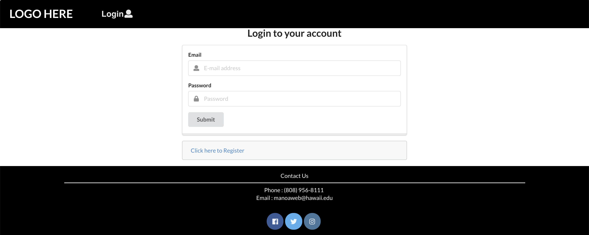
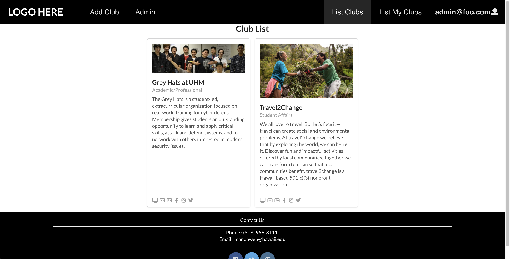
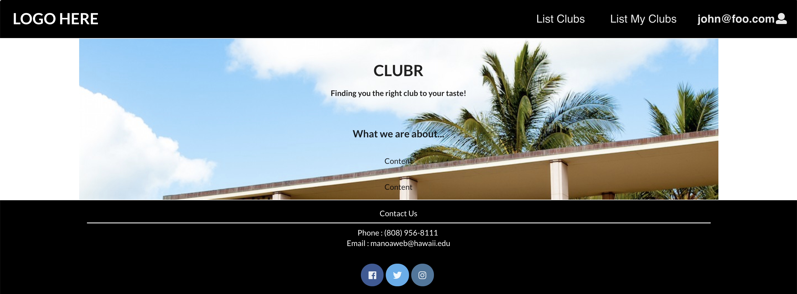
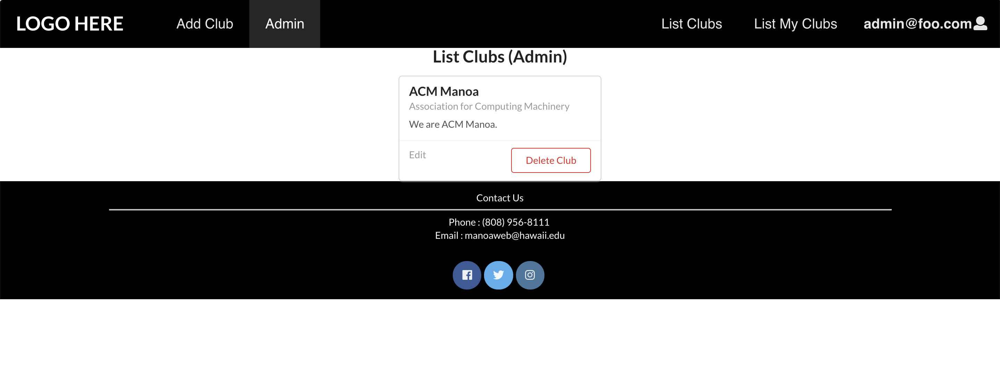
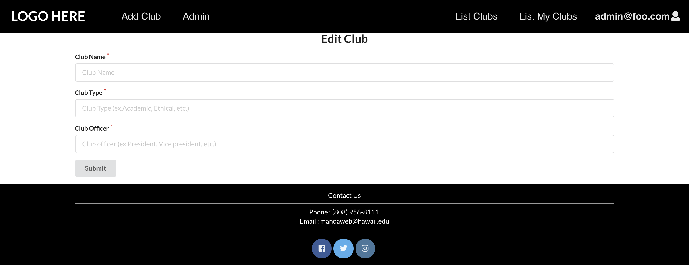
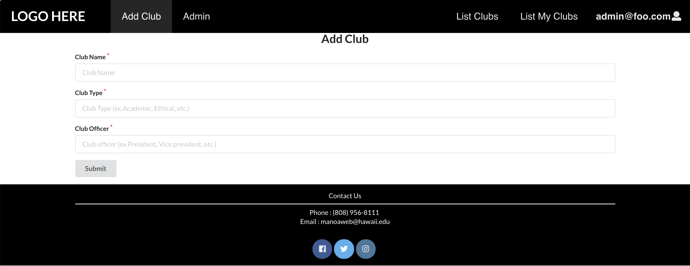
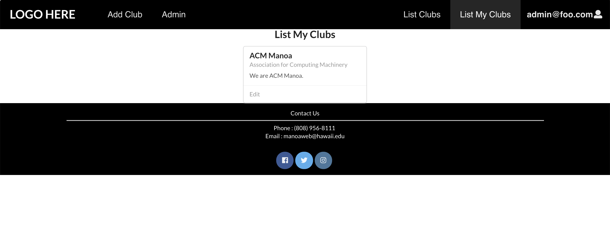
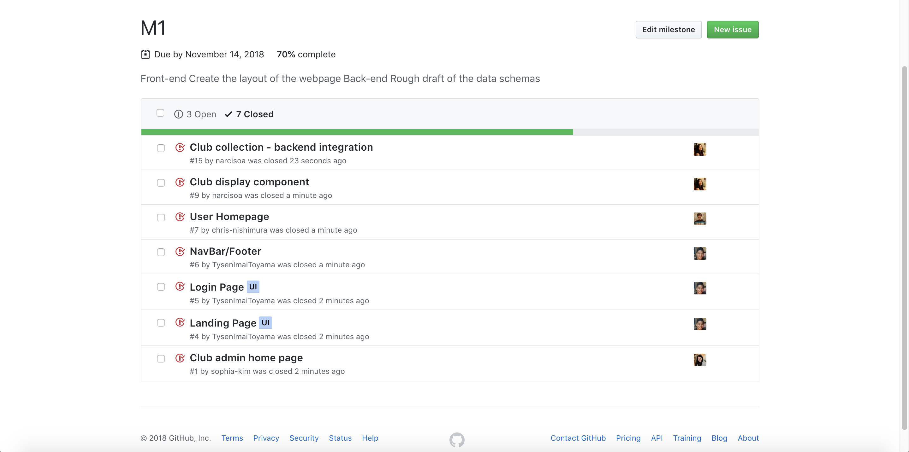
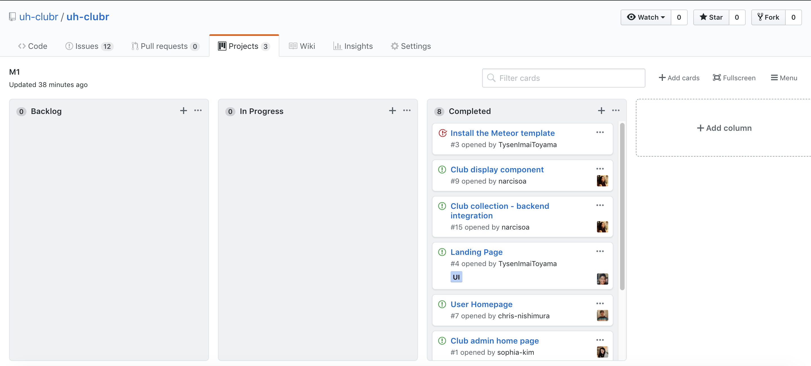

# Table of contents

* [About UH-Clubr](#about-uh-clubr)
* [Installation](#installation)
* [Application design](#application-design)
  * [Directory structure](#directory-structure)
  * [Import conventions](#import-conventions)
  * [Naming conventions](#naming-conventions)
  * [Data model](#data-model)
  * [CSS](#css)
  * [Routing](#routing)
  * [Authorization](#authorization)
  * [Configuration](#configuration)
  * [Quality Assurance](#quality-assurance)
    * [ESLint](#eslint)
    * [Data model unit tests](#data-model-unit-tests)
    * [JSDoc](#JSDoc)
* [Development history](#development-history)
  * [Milestone 1: Mockup development](#milestone-1-mockup-development)
  * [Milestone 2: Data model development](#milestone-2-data-model-development)
  * [Milestone 3: Connect UI to data model](#milestone-3-connect-ui-to-data-model)
* [About the Members of UH-Clubr](#about-members)

# About UH-Clubr 

UH-Clubr is a Meteor application providing the directory for the organizations at the University of Hawaii at Manoa. The UH-Clubr application will provide a centralized directory for UH Manoa student clubs. UH Manoa students can login to browse a well organized directory of all current student clubs, with brief descriptions, meeting times and locations, URLs to their websites (if any), contact information for officers, and a few select photos. 

You can find the UH-Clubr website [here.](http://uhclubr.meteorapp.com/#/) 

When you come to the site, you are greeted by the following landing page:


Anyone can login to UH-Clubr by clicking on the login button. If the user does not have an account, then he or she may sign up to create an account:



Once logged in, you can create a profile that provides a biographical statement and list of interests, plus links to selected social media sites (GitHub, FaceBook, Instagram).
  
After creating a profile, you will be listed on the public directory page, which then will allow you to take a look at all the independent organizations at UH Manoa:



UH-Clubr also provides a filter page, available to those who can login to the system with their UH account. The filter page allows you to display all organizations with a given interest.

Details regarding the development of the application can be found via the Github organization [UH-Clubr](https://github.com/uh-clubr).
 
# Installation

First, [install Meteor](https://www.meteor.com/install).

Second, [download a copy of UH-Clubr] or clone it using git.
  
Third, cd into the app/ directory and install libraries with:

```
$ meteor npm install
```

Fourth, run the system with:

```
$ meteor npm run start
```

If all goes well, the application will appear at [http://localhost:3000](http://localhost:3000). If you have an account on the UH test CAS server, you can login.  

# Application Design

## Directory structure

The top-level directory structure contains:

```
app/        # holds the Meteor application sources
config/     # holds configuration files, such as settings.development.json
.gitignore  # don't commit IntelliJ project files, node_modules, and settings.production.json
```

This structure separates configuration files (such as the settings files) in the config/ directory from the actual Meteor application in the app/ directory.

The app/ directory has this top-level structure:

```
client/
  lib/           # holds Semantic UI files.
  head.html      # the <head>
  main.js        # import all the client-side html and js files. 

imports/
  api/           # Define collection processing code (client + server side)
    base/
    interest/
    profile/
  startup/       # Define code to run when system starts up (client-only, server-only)
    client/        
    server/        
  ui/
    components/  # templates that appear inside a page template.
    layouts/     # Layouts contain common elements to all pages (i.e. menubar and footer)
    pages/       # Pages are navigated to by FlowRouter routes.
    stylesheets/ # CSS customizations, if any.

node_modules/    # managed by Meteor

private/
  database/      # holds the JSON file used to initialize the database on startup.

public/          
  images/        # holds static images for landing page and predefined sample users.
  
server/
   main.js       # import all the server-side js files.
```

## Import conventions

This system adheres to the Meteor 1.4 guideline of putting all application code in the imports/ directory, and using client/main.js and server/main.js to import the code appropriate for the client and server in an appropriate order.

This system accomplishes client and server-side importing in a different manner than most Meteor sample applications. In this system, every imports/ subdirectory containing any Javascript or HTML files has a top-level index.js file that is responsible for importing all files in its associated directory.   

Then, client/main.js and server/main.js are responsible for importing all the directories containing code they need. For example, here is the contents of client/main.js:

```
import '/imports/startup/client';
import '/imports/ui/components/form-controls';
import '/imports/ui/components/directory';
import '/imports/ui/components/user';
import '/imports/ui/components/landing';
import '/imports/ui/layouts/directory';
import '/imports/ui/layouts/landing';
import '/imports/ui/layouts/shared';
import '/imports/ui/layouts/user';
import '/imports/ui/pages/directory';
import '/imports/ui/pages/filter';
import '/imports/ui/pages/landing';
import '/imports/ui/pages/user';
import '/imports/api/base';
import '/imports/api/profile';
import '/imports/api/interest';
import '/imports/ui/stylesheets/style.css';
```

Apart from the last line that imports style.css directly, the other lines all invoke the index.js file in the specified directory.

We use this approach to make it more simple to understand what code is loaded and in what order, and to simplify debugging when some code or templates do not appear to be loaded.  In our approach, there are only two places to look for top-level imports: the main.js files in client/ and server/, and the index.js files in import subdirectories. 

Note that this two-level import structure ensures that all code and templates are loaded, but does not ensure that the symbols needed in a given file are accessible.  So, for example, a symbol bound to a collection still needs to be imported into any file that references it. 
 
## Naming conventions

This system adopts the following naming conventions:

  * Files and directories are named in all lowercase, with words separated by hyphens. Example: accounts-config.js
  * "Global" Javascript variables (such as collections) are capitalized. Example: Profiles.
  * Other Javascript variables are camel-case. Example: collectionList.
  * Templates representing pages are capitalized, with words separated by underscores. Example: Directory_Page. The files for this template are lower case, with hyphens rather than underscore. Example: directory-page.html, directory-page.js.
  * Routes to pages are named the same as their corresponding page. Example: Directory_Page.


## Data model

The UH Clubr's data model is implemented by two Javascript classes: [ProfileCollection] and [InterestCollection]. Both of these classes encapsulate a MongoDB collection with the same name and export a single variable (Profiles and Interests)that provides access to that collection. 

Any part of the system that manipulates the UH Clubr's data model imports the Profiles or Interests variable, and invokes methods of that class to get or set data.

There are many common operations on MongoDB collections. To simplify the implementation, the ProfileCollection and InterestCollection classes inherit from the [BaseCollection] class.

## CSS

The application uses the [Semantic UI](http://semantic-ui.com/) CSS framework. To learn more about the Semantic UI theme integration with Meteor, see [Semantic-UI-Meteor](https://github.com/Semantic-Org/Semantic-UI-Meteor).

The Semantic UI theme files are located in [app/client/lib/semantic-ui](https://github.com/ics-software-engineering/meteor-application-template/tree/master/app/client/lib/semantic-ui) directory. Because they are located in the client/ directory and not the imports/ directory, they do not need to be explicitly imported to be loaded. (Meteor automatically loads all files into the client that are located in the client/ directory). 

Note that the user pages contain a menu fixed to the top of the page, and thus the body element needs to have padding attached to it.  However, the landing page does not have a menu, and thus no padding should be attached to the body element on that page. 

## Routing

## Authorization

The landing and directory pages are public; anyone can access those pages.

The profile and filter pages require authorization: you must be logged in (i.e. authenticated) through the UH test CAS server, and the authenticated username returned by CAS must match the username specified in the URL. 

## Configuration

## Quality Assurance

### ESLint

UH Clubr includes a [.eslintrc] file to define the coding style adhered to in this application. You can invoke ESLint from the command line as follows:

```
meteor npm run lint
```

ESLint should run without generating any errors.  

It's significantly easier to do development with ESLint integrated directly into your IDE (such as IntelliJ).

### Data model unit tests

### JSDoc

# Development History

## Milestone 1: Mockup development
This milestone started on November 5, 2018 and ended on November 14, 2018.

The goal of Milestone 1 was to create a set of HTML pages providing a mockup of the pages in the system. To simplify things, the mockup was developed as a Meteor app. This meant that each page was a template and the UI and the backend functionality weren't entirely implemented.

Mockups for the following six pages were implemented during M1:

The user is greeted by the [landing page.](http://uhclubr.meteorapp.com/#/)


The user can access the [club directory](http://uhclubr.meteorapp.com/#/list) after signing in:


If you are logged in as the master admin, you can edit or delete the clubs by the [following link.](http://uhclubr.meteorapp.com/#/admin)



You may also [add a new club](http://uhclubr.meteorapp.com/#/add) as the master admin:


If you are logged in as the club admin, you can edit the information of the club you are responsible for as shown [here.](http://uhclubr.meteorapp.com/#/clubadminlist)



Milestone 1 was implemented as [UH-Clubr GitHub Milestone M1](https://github.com/uh-clubr/uh-clubr/milestone/1)::




Milestone 1 consisted of seven issues, and progress was managed via the [UH-Clubr GitHub Project M1](https://github.com/uh-clubr/uh-clubr/projects/2):



## Milestone 2: Data model development 
Milestone 2 will be implemented as [UH-Clubr GitHub Milestone M2](https://github.com/uh-clubr/uh-clubr/milestone/2)::


Milestone 2 will consist of eight issues, and progress will be managed via the [UH-Clubr GitHub Project M2](https://github.com/uh-clubr/uh-clubr/projects/3):

## Milestone 3: Connect UI to data model


# About Members
Andrea Narciso is an ICS student at UH Manoa graduating in May 2019. She is interested in product development, project management, data and business analysis.
  * [Technical Portfolio](https://narcisoa.github.io/)
  * [LinkedIn](https://www.linkedin.com/in/narcisoandrea/)

Sophia Kim is an ICS student at UH Manoa graduating in May 2021. She is interested in machine learning, cyber security, artifical intelligence and entrepreneurship.
  * [Technical Portfolio](https://sophia-kim.github.io/)
  * [LinkedIn](https://www.linkedin.com/in/sophiajhkim/)

Tysen Imai-Toyama is an ICS student at UH Manoa graduating in May 2020. He is interested in Software development, data analysis and cryptology.
  * [Technical Portfolio](https://tysenimaitoyama.github.io/)
  * [LinkedIn](https://www.linkedin.com/in/tysen-imai-toyama-b91a49149/)

Christopher Nishimura is an ICS student at UH Manoa graduating in May 2020. He is interested in web design, software development and video game design.
  * [Technical Portfolio](https://chris-nishimura.github.io/)
  * [LinkedIn](http://www.linkedin.com/in/christopher-nishimura-8a000bb8)
