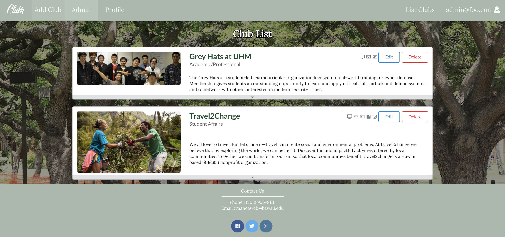
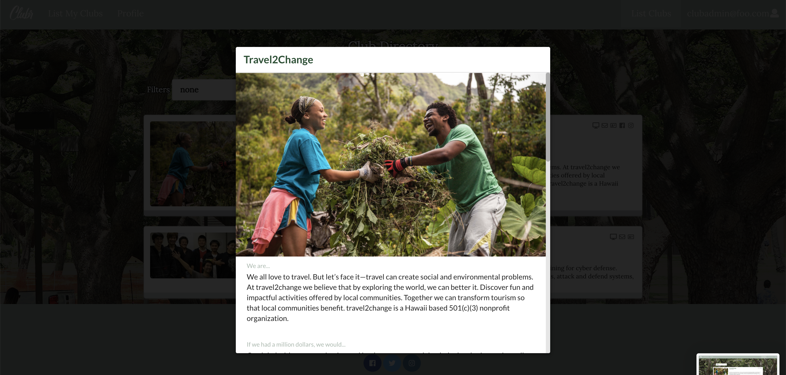
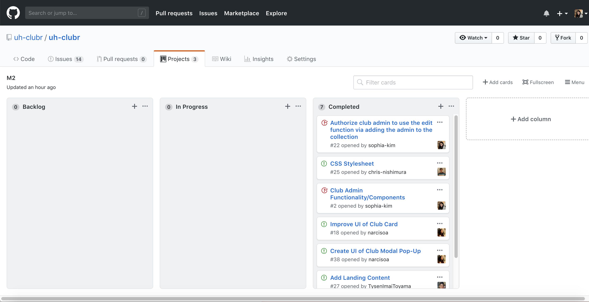

# UH-Clubr

* [About UH-Clubr](#about-uh-clubr)
* [Developer Guide](#developer-guide)
* [User Guide](#user-guide)
* [Community Feedback](#community-feedback)
* [Development history](#development-history)
  * [Milestone 1: Mockup development](#milestone-1-mockup-development)
  * [Milestone 2: Data model development](#milestone-2-data-model-development)
  * [Milestone 3: Connect UI to data model](#milestone-3-connect-ui-to-data-model)
* [About the Members of UH-Clubr](#about-members)

# About UH-Clubr 

UH-Clubr is a Meteor application providing the directory for the organizations at the University of Hawaii at Manoa. The UH-Clubr application will provide a centralized directory for UH Manoa student clubs. UH Manoa students can login to browse a well organized directory of all current student clubs, with brief descriptions, meeting times and locations, URLs to their websites (if any), contact information for officers, and a few select photos. 

You can find the UH-Clubr website [here.](http://uhclubr.meteorapp.com/#/) 

When you come to the site, you are greeted by the following landing page:


It is not necessary that the user signs in or sign up to view the clubs that are listed; the list club page is entirely public. However, if the user hopes to receive emails about new clubs that are added, then he or she may sign up and create an account (email function is not implemented) using the sign-up box on the landing page:


If the user already has an account with UH-Clubr, he or she may log in:


Once logged in, the user can create a profile that provides a brief description about themselves such as their major, their interest, their email address, etc.:


  
After creating profile, the user will be redirected to the landing page with testimonials from the users who have pleasurable experiences with the application, where he or she may choose to go to their profile to update it, or go to the club list page to take a look at all the independent organizations established at the University of Hawaii at Manoa:


Details regarding the development of the application can be found via the Github organization [UH-Clubr](https://github.com/uh-clubr).
 
# Developer Guide

First, [install Meteor](https://www.meteor.com/install).

Second, [download a copy of UH-Clubr] or clone it using git.
  
Third, cd into the app/ directory and install libraries with:

```
$ meteor npm install
```

Fourth, run the system with:

```
$ meteor npm run start
```

If all goes well, the application will appear at [http://localhost:3000](http://localhost:3000). You may sign up for an account on UH-Clubr if you don't have one, or sign in if you do. 

# User Guide

If the logged-in user is not defined as an admin, then she/he doesn't have much authority in the UH-Clubr application. However, if the logged-in user is defined as an admin, then he or she may be able to edit, delete or add depending on their level of authority. Currently, the master admin (the admin that is in charge of the web application) is able to add and edit the clubs following required fields defined in the ClubSchema:




If the logged-in user is defined as a club admin, then he or she is able to edit the club that they're responsible for:


The club admins are given authority via the owner field of each club.

If the logged-in user is neither a club or a master admin, he or she is still able to view clubs that focus on specific interest areas or edit their profile page:


# Community Feedback
We have asked five of the UH community members to test out the UH-Clubr application and provide some feedbacks.
Here were some of the inputs that we have received from the community members:

“The website looks clean, but it’s not as user friendly. I didn’t know there was a dropdown to see more information about the club. Maybe have it open when you click on the whole box?”

"Very professional and conveys information clearly.” 

“Are there more clubs? I was trying to scroll because I knew there must be more…"

"I like the idea of the website and can see it being useful. Overall it looks nice, just wish there were more clubs on it."

"I like that the website isn't so serious. It provides the information it needs to provide, but also adds some fun to it by adding the extra questions about the clubs. I wish there were more clubs though."

From these feedbacks that we have received, we could see that there is still a room for more improvements to make the application more user friendly and practical. The web application is still a work-in-progress and hence what's displayed currently is a prototype but not a completely finished product. 

# Development History

## Milestone 1: Mockup development
This milestone started on November 5, 2018 and ended on November 14, 2018.

The goal of Milestone 1 was to create a set of HTML pages providing a mockup of the pages in the system. To simplify things, the mockup was developed as a Meteor app. This meant that each page was a template and the UI and the backend functionality weren't entirely implemented.

Mockups for the following six pages were implemented during M1:

The user is greeted by the [landing page.](http://uhclubr.meteorapp.com/#/)


The user can access the [club directory](http://uhclubr.meteorapp.com/#/list) after signing in:


If you are logged in as the master admin, you can edit or delete the clubs by the [following link.](http://uhclubr.meteorapp.com/#/admin)


You may also [add a new club](http://uhclubr.meteorapp.com/#/add) as the master admin:


If you are logged in as the club admin, you can edit the information of the club you are responsible for as shown [here.](http://uhclubr.meteorapp.com/#/clubadminlist)


Milestone 1 was implemented as [UH-Clubr GitHub Milestone M1](https://github.com/uh-clubr/uh-clubr/milestone/1):


Milestone 1 consisted of seven issues, and progress was managed via the [UH-Clubr GitHub Project M1](https://github.com/uh-clubr/uh-clubr/projects/2):


## Milestone 2: Data model development 
This milestone started on November 15, 2018 and ended on November 28, 2018.

Milestone 2 focused on the back-end operations as well as the front-end. The team took the time to implement the functionalities that were suggested in Milestone 1 and connected them to UI. The team also focused on improving the layout of the clubs that will make the visit to the website a pleasurable experience. 

The layout of the clubs has been updated from the previous milestone:




Now the web application provides cleaner and simpler layout of the clubs, while giving the user the ability to expand to obtain more detailed information about the club the user is interested in.

The user is also able to select interest areas so that they can see clubs that focus on those areas:


(Please note that at this point of development, the filter function was not fully implemented.)

Milestone 2 was implemented as [UH-Clubr GitHub Milestone M2](https://github.com/uh-clubr/uh-clubr/milestone/2):


Milestone 2 consisted of eight issues, and progress will be managed via the [UH-Clubr GitHub Project M2](https://github.com/uh-clubr/uh-clubr/projects/3):



## Milestone 3: Connect UI to data model
This milestone started on November 29, 2018 and ended on December 5, 2018.

Milestone 3 focused on improving the overall UI of the web application as well as enabling the full functionalities of the application that the members had originally desired. The team divided the tasks into four different categories, where each category focused on furnishing the areas the members have been responsible for since the beginning of the development. 

Now the web application resembles the dating websites that we were inspired by, and allows the admins to add a few interesting facts about themselves to have future Clubrs more engaged:


The filter function, which was introduced in Milestone 2 but was not fully functional, has been completed in this milestone:


Now when the user clicks on the dropdown menu, he or she may choose an option that they are interested in and see all the clubs that are related to their specific area of interest.

Milestone 3 was implemented as [UH-Clubr GitHub Milestone M3](https://github.com/uh-clubr/uh-clubr/milestone/3):


Milestone 3 consisted of 14 issues, and progress was managed via the [UH-Clubr GitHub Project M3](https://github.com/uh-clubr/uh-clubr/projects/4):


# About Members
Andrea Narciso is an ICS student at UH Manoa graduating in May 2019. She is interested in product development, project management, data and business analysis.
  * [Technical Portfolio](https://narcisoa.github.io/)
  * [LinkedIn](https://www.linkedin.com/in/narcisoandrea/)

Sophia Kim is an ICS student at UH Manoa graduating in May 2021. She is interested in machine learning, cyber security, artifical intelligence and entrepreneurship.
  * [Technical Portfolio](https://sophia-kim.github.io/)
  * [LinkedIn](https://www.linkedin.com/in/sophiajhkim/)

Tysen Imai-Toyama is an ICS student at UH Manoa graduating in May 2020. He is interested in Software development, data analysis and cryptology.
  * [Technical Portfolio](https://tysenimaitoyama.github.io/)
  * [LinkedIn](https://www.linkedin.com/in/tysen-imai-toyama-b91a49149/)

Christopher Nishimura is an ICS student at UH Manoa graduating in May 2020. He is interested in web design, software development and video game design.
  * [Technical Portfolio](https://chris-nishimura.github.io/)
  * [LinkedIn](http://www.linkedin.com/in/christopher-nishimura-8a000bb8)
